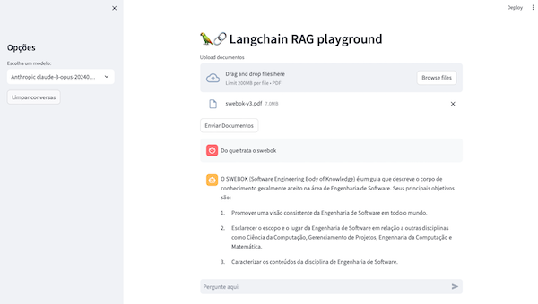
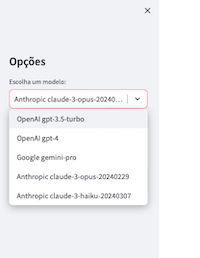

# RAG-PLAY

Esse é o RAG playground, um ensaio para testar a capacidade da biblioteca *langchain*
de abstrair a programação de LLMs com vários modelos diferentes ao mesmo tampo.

## Visão geral

**Retrieval Augmented Generation** (RAG) é uma ferramenta poderosa para recuperação de documentos, sumarização e interação 
em sessões de perguntas e respostas. Este projeto utiliza LangChain, Streamlit e Chroma para fornecer uma aplicação 
web integrada, permitindo aos usuários realizar essas tarefas. 
Com o RAG, você pode facilmente fazer upload de múltiplos documentos em PDF, gerar embeddings vetoriais para o 
texto contido nesses documentos e realizar interações conversacionais com os documentos. 
O histórico de conversas também é lembrado para uma experiência mais interativa.

## Funcionalidades

- **Aplicativo Web Streamlit**: O projeto é construído usando Streamlit, proporcionando uma interface web intuitiva e interativa para os usuários.
- **Opções de Modelos e LLM**: Podem escolher entre diversas opções de modelos e LLMs.    
- **Carregador de Documentos**: Os usuários podem fazer upload de vários arquivos PDF, que são então processados para análise posterior.
- **Divisão de Documentos**: Os PDFs carregados são divididos em pequenos blocos de texto, garantindo compatibilidade com modelos que têm limites de tokens.
- **Embeddings Vetoriais**: Os blocos de texto são convertidos em embeddings vetoriais, facilitando a realização de tarefas de recuperação e resposta a perguntas.
- **Conversas Interativas**: Os usuários podem se engajar em conversas interativas com os documentos, fazendo perguntas e recebendo respostas. O histórico de chat é preservado para referência.

## Pré-requisitos

Antes de executar o projeto, certifique-se de ter os seguintes pré-requisitos:

- Python 3.11
- LangChain
- Streamlit
- Chroma
- Uma chave da API da OpenAI, Google e Anthropic
- Documentos em PDF para fazer upload

## Uso

1. Clone o repositório para sua máquina local:

   ```bash
   git clone https://github.com/gapfranco/rag-play.git
   cd rag-play
   ```

2. Instale as dependências necessárias executando:
   ```bash
   poetry shell
   poetry install
   ```

3. Prepare o ambiente com as opções de LLM:

   Renomeie o arquivo *.env.template* como *.env* e atualize as chaves de API para
   aquelas que deseja utilizar. Vai determinar as opções de LLM. 

   ```
   GOOGLE_API_KEY=1111
   OPENAI_API_KEY=2222
   ANTHROPIC_API_KEY=333
   ```
   
4. Crie os diretórios para o chroma vector store:
   ```bash
   mkdir -p data/vector_store
   ```

5. Execute o aplicativo Streamlit:
   ```bash
   streamlit run main.py
   ```

6. Acesse o aplicativo abrindo um navegador web e navegando até o URL fornecido.
 
   

7. Escolha o modelo e LLM que deseja testar. Apenas as opções que tiverem API keys definidas vão aparecer.

   

8. Faça o upload dos documentos em PDF que deseja analisar.

9. Clique no botão "Enviar Documentos" para processar os documentos e gerar embeddings vetoriais.

10. Engaje-se em conversas interativas com os documentos digitando suas perguntas na caixa de entrada do chat.

## Licença

Esse projeto é distribuido sob a licença MIT. Veja o arquivo `LICENSE` para detalhes.

## Contato

- Gonçalo Franco - [gapfranco@gmail.com](mailto:gapfranco@gmail.com)
- Project Link: [https://github.com/gapfranco/rag-play](https://github.com/gapfranco/rag-play)
